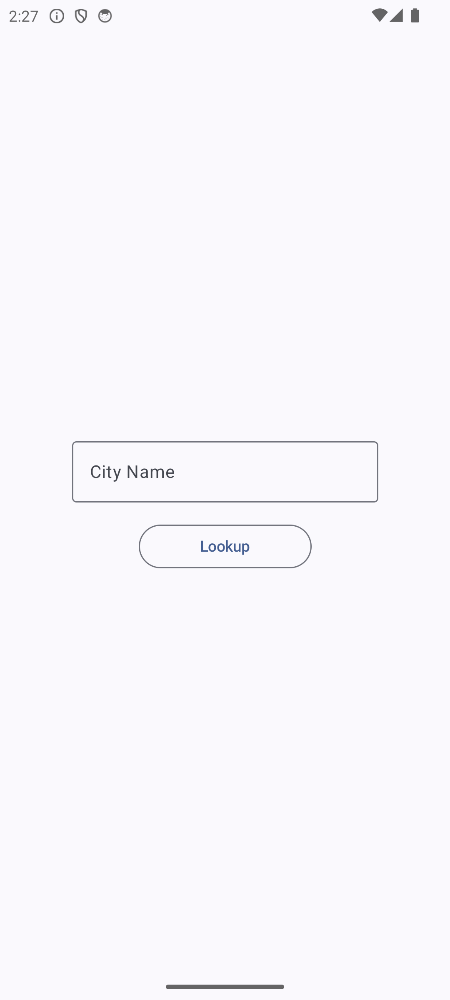
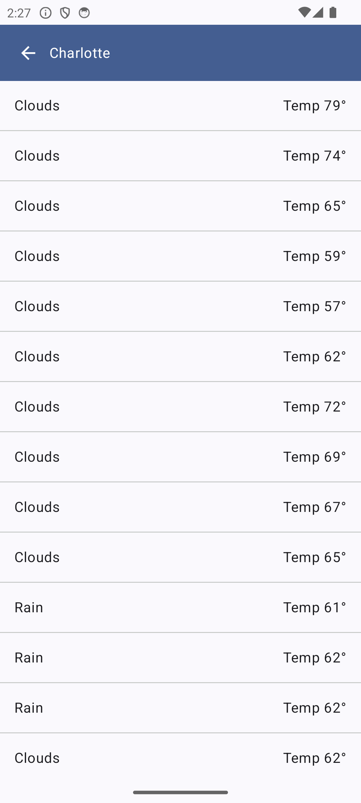
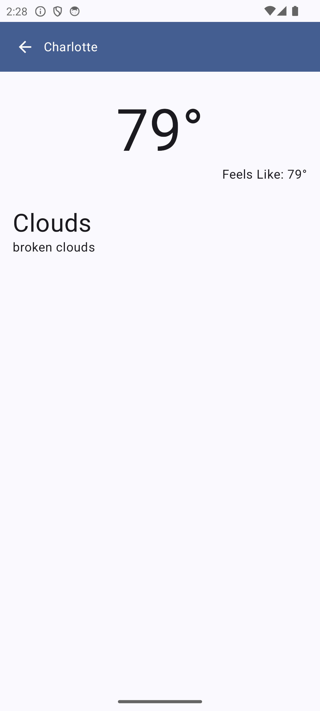

# 🌤️ Weather App

> A modern Android weather application built with Jetpack Compose and Clean Architecture principles

**Author:** Justin Smith

[](https://developer.android.com)
[](https://kotlinlang.org)
[](https://developer.android.com/jetpack/compose)
[](https://developer.android.com/studio/releases/platforms)

## 📋 Table of Contents
- [Overview](#overview)
- [Features](#features)
- [Screenshots](#screenshots)
- [Tech Stack](#tech-stack)
- [Setup](#setup)
- [Architecture](#architecture)
- [API](#api)
- [Project Structure](#project-structure)
- [Contributing](#contributing)

## 🌟 Overview

Weather App is a clean, intuitive Android application that provides users with detailed weather forecasts for any city worldwide. Built using modern Android development practices, the app demonstrates the implementation of MVVM architecture, Jetpack Compose, and reactive programming with Kotlin Coroutines.

### Key Functionality
- 🔍 **City Search**: Enter any city name to get its weather forecast
- 📊 **5-Day Forecast**: View detailed weather predictions
- 🌡️ **Temperature Details**: See current temperature and "feels like" values
- 📱 **Responsive UI**: Modern Material 3 design with smooth animations
- ⚡ **Real-time Data**: Live weather data from OpenWeatherMap API

## ✨ Features

- **Clean Architecture**: Separation of concerns with clear data flow
- **Jetpack Compose UI**: Modern declarative UI toolkit
- **MVVM Pattern**: Reactive state management with ViewModels
- **Dependency Injection**: Manual DI container (production-ready for Hilt/Koin)
- **Network Layer**: Ktor client for HTTP requests
- **Error Handling**: Comprehensive error states and user feedback
- **Unit Conversion**: Automatic Kelvin to Fahrenheit conversion
- **Offline-First Ready**: Architecture supports caching implementations

## 📸 Screenshots

| City Lookup | Forecast List | Forecast Details |
|-------------|---------------|------------------|
|  |  |  |

## 🛠 Tech Stack

### Frontend
- **UI Framework**: Jetpack Compose with Material 3
- **Navigation**: Navigation Compose
- **State Management**: ViewModel + Compose State

### Backend & Data
- **HTTP Client**: Ktor Client with OkHttp engine
- **Serialization**: Kotlinx Serialization JSON
- **Coroutines**: Kotlin Coroutines for async operations

### Architecture
- **Pattern**: MVVM (Model-View-ViewModel)
- **DI**: Manual Dependency Injection (AppContainer)
- **Repository Pattern**: Clean separation of data sources

### Build Tools
- **Build System**: Gradle with Version Catalogs
- **Language**: Kotlin 100%
- **Min SDK**: 21 (Android 5.0)
- **Target SDK**: 36

## ⚙️ Setup

### Prerequisites
- Android Studio Hedgehog or later
- JDK 11 or later
- Android SDK 21+
- OpenWeatherMap API key

### Installation

1. **Clone the repository**
   ```bash
   git clone https://github.com/yourusername/WeatherApp.git
   cd WeatherApp
   ```

2. **Get API Key**
   - Visit [OpenWeatherMap](https://openweathermap.org/api)
   - Sign up and get your free API key

3. **Configure API Key**
   Create a `local.properties` file in the root directory:
   ```properties
   # local.properties
   API_KEY="your_openweathermap_api_key_here"
   ```

4. **Build and Run**
   ```bash
   ./gradlew assembleDebug
   ```
   Or open in Android Studio and run directly.

## 🏗 Architecture

This app follows Clean Architecture principles with clear separation of concerns:

```
┌─────────────────────────────────────┐
│              UI Layer               │
│  (Compose Screens + ViewModels)     │
└─────────────────┬───────────────────┘
                  │
┌─────────────────▼───────────────────┐
│            Domain Layer             │
│     (Repository Interfaces)         │
└─────────────────┬───────────────────┘
                  │
┌─────────────────▼───────────────────┐
│             Data Layer              │
│  (Repository Impl + Network)        │
└─────────────────────────────────────┘
```

### Data Flow
1. **UI Layer**: Compose screens observe ViewModel state
2. **ViewModel**: Manages UI state and coordinates with repository
3. **Repository**: Abstracts data sources and business logic
4. **Network**: Ktor client handles API communication

## 🌐 API

**Base URL**: `https://api.openweathermap.org/data/2.5/`

**Endpoint**: `forecast?q={city}&appid={api_key}`

**Response**: 5-day weather forecast with 3-hour intervals

### Example Response
```json
{
  "cod": "200",
  "message": 0,
  "cnt": 40,
  "list": [
    {
      "dt": 1578398400,
      "main": {
        "temp": 283.15,
        "feels_like": 281.65,
        "temp_min": 283.15,
        "temp_max": 283.15
      },
      "weather": [
        {
          "id": 800,
          "main": "Clear",
          "description": "clear sky",
          "icon": "01d"
        }
      ]
    }
  ]
}
```

## 📁 Project Structure

```
app/
└── src/main/java/com/example/weatherapp/
    ├── 🚀 Application Entry Point
    │   ├── WeatherApplication.kt          # DI container setup
    │   ├── MainActivity.kt                # Main activity
    │   └── ui/WeatherApp.kt               # Navigation & app composition
    │
    ├── 📱 UI Layer
    │   ├── ui/
    │   │   ├── LookupScreen.kt            # City search screen
    │   │   ├── ForecastScreen.kt          # Weather list screen
    │   │   ├── DetailsScreen.kt           # Detailed forecast screen
    │   │   └── composables/
    │   │       ├── CityHeader.kt          # Reusable city header
    │   │       ├── ErrorScreen.kt         # Error state UI
    │   │       └── Loading.kt             # Loading state UI
    │   └── theme/                         # Material 3 theming
    │
    ├── 🧠 Presentation Layer
    │   └── viewmodel/
    │       └── ForecastViewModel.kt       # State management
    │
    ├── 📊 Data Layer
    │   ├── model/
    │   │   ├── DisplayForecast.kt         # UI models
    │   │   └── WeatherResponse.kt         # API response models
    │   ├── data/
    │   │   ├── AppContainerImpl.kt        # DI implementation
    │   │   └── WeatherRepositoryImpl.kt   # Data repository
    │   └── network/
    │       └── WeatherService.kt          # Ktor HTTP client
    │
    └── ⚙️ Utilities
        └── util/
            └── kelvinToFahrenheit.kt      # Temperature conversion
```

### Key Components

#### 🚀 **Entry Points**
- **`WeatherApplication.kt`**: Sets up the dependency injection container
- **`MainActivity.kt`**: Configures the main screen with edge-to-edge display
- **`WeatherApp.kt`**: Handles navigation and overall app composition

#### 📱 **UI Components**
- **`LookupScreen.kt`**: Search interface for entering city names
- **`ForecastScreen.kt`**: Displays weather forecast list with pull-to-refresh
- **`DetailsScreen.kt`**: Shows detailed weather information
- **Composables**: Reusable UI components following single responsibility principle

#### 🧠 **State Management**
- **`ForecastViewModel.kt`**: Manages UI state using StateFlow and handles business logic
- Reactive state updates with proper error handling and loading states

#### 📊 **Data Management**
- **Repository Pattern**: Clean abstraction over data sources
- **DTO Separation**: Prevents coupling between API and UI models
- **Manual DI**: Production-ready structure (easily upgradeable to Hilt/Koin)

#### 🌐 **Network Layer**
- **Ktor Client**: Multiplatform HTTP client with OkHttp engine
- **JSON Serialization**: Type-safe parsing with kotlinx.serialization
- **Error Handling**: Comprehensive network error management

## 🏃‍♂️ Getting Started

### Quick Start
1. Clone the repo and open in Android Studio
2. Add your OpenWeatherMap API key to `local.properties`
3. Build and run the app
4. Search for any city to see its 5-day forecast!

### Development Workflow
```bash
# Debug build
./gradlew assembleDebug

# Run tests
./gradlew test

# Clean build
./gradlew clean build
```

## 📝 Contributing

Contributions are welcome! Please feel free to submit a Pull Request. For major changes, please open an issue first to discuss what you would like to change.

### Development Guidelines
- Follow existing code style and architecture patterns
- Add unit tests for new features
- Update documentation as needed
- Use meaningful commit messages

### Potential Enhancements
- 💾 **Local Caching**: Add Room database for offline support
- 📍 **Location Services**: Auto-detect user location
- 🌈 **Weather Icons**: Add animated weather icons
- 🔔 **Notifications**: Weather alerts and daily forecasts
- 🌍 **Multiple Units**: Support for Celsius, Fahrenheit, Kelvin
- 🎨 **Themes**: Dark mode and custom color schemes
- 🧠 **AI Integration**: Weather-based activity suggestions

---

**Built with ❤️ using Android Jetpack Compose**
